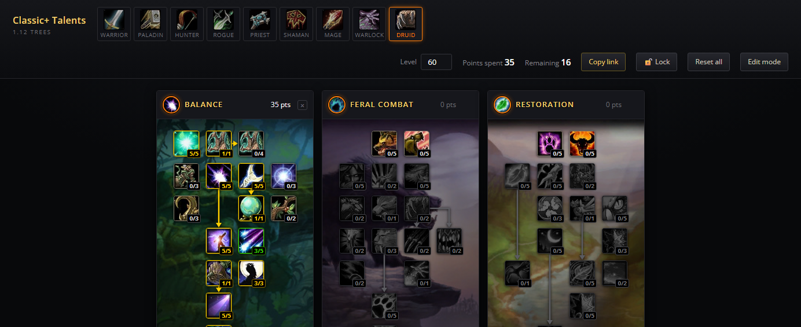
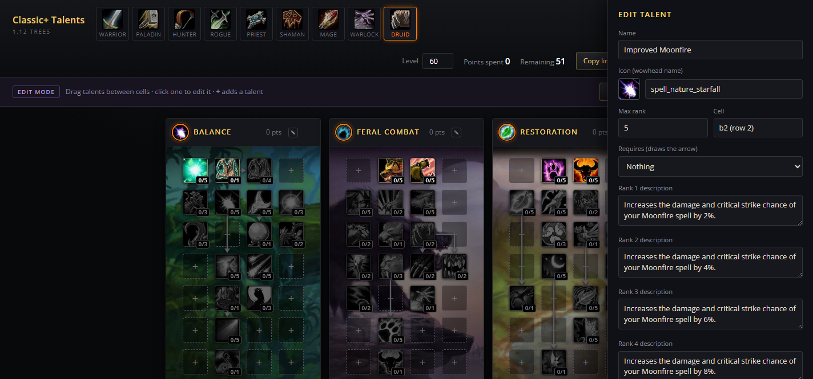

# Classic+ Talent Calculator

A talent calculator with saved builds backed by SQLite. It ships six sets of trees and
switches between them from the bar at the top:

| Edition | Trees | Cap | Editable |
| --- | --- | --- | --- |
| **Classic+** | your own, starting from 1.12 — 9 classes, 432 talents | 51 @ 60 | yes, in edit mode |
| **Forever** | Blizzard's Classic+ — 9 classes, 469 talents | 51 @ 60 | no |
| **Vanilla** | 1.12 — 9 classes, 432 talents | 51 @ 60 | no |
| **TBC** | 2.4.3 — 9 classes, 579 talents | 61 @ 70 | no |
| **Wrath** | 3.3.5 — 10 classes, 829 talents | 71 @ 80 | no |
| **Cataclysm** | 4.3.4 — 10 classes, 597 talents | 41 @ 85 | no |

Death Knight appears in Wrath and Cataclysm only.



## Running it

```bash
docker compose up -d          # http://localhost:8080
```

That is the whole setup: the image builds `index.html` from `src/`, runs as a
non-root user, health-checks itself, and keeps saved builds in a named volume.
Change the port with `PORT=9000 docker compose up -d`.

Without Docker:

```bash
node server.js                # http://localhost:8080, sqlite at ./data/talents.db
```

Or just open `index.html` in a browser. With no server behind it the calculator
works exactly the same, except saved builds go to that browser's `localStorage`
instead of SQLite.

There are no npm dependencies anywhere — `node:http` and `node:sqlite` come with Node
(24+). Nothing to install, nothing to audit.

## Using it

| Action | Result |
| --- | --- |
| Edition logo (top row) | Switches which trees you are looking at |
| Compare | Opens the board — trees from any editions, side by side |
| Info | What the site is, and a box for suggestions |
| Left click | Spend one point |
| Right click | Remove one point |
| Shift + click | Spend or remove every rank at once |
| Level box | Sets the point budget (`level - 9`, capped by the edition) |
| Copy link | Puts the build in the URL — the hash updates as you click |
| Save build | Stores the build in SQLite under a name |
| 🔗 on a saved build | Copies its short `/b/<id>` share link |
| `×` in a tree header | Clears just that tree |

Talents grey out until their tier and prerequisite are satisfied, and a point can't be
removed if doing so would strand a talent below it — the same rules the game enforces.
The server re-checks those rules before writing, so an edited share code can't put an
illegal build in the database.

## Spec bar

Under the trees, each spec gets its icon, its points and a bar. The bar is measured
against the points that reach the **bottom of that tree** — 31 in Classic, so a full
bar means the capstone is paid for. The deepest tree is outlined, since that is the
spec you are actually playing.

## Compare board

**Compare** in the top bar swaps the three trees for a board you can fill from
anywhere: Forever's Arms next to Vanilla's Arms next to Wrath's, or a Cataclysm
Death Knight tree beside a Classic+ one. `×` removes a panel, `+` adds one, and
the grip reorders them.

**Each panel is its own little build.** Its own points, its own tier gates, its own
cap taken from the edition it came from — because a 41-point Cataclysm tree and a
71-point Wrath tree do not share a budget in any meaningful way. Clicking works
exactly as it does in the normal view.

Boards get their own link, so a comparison can be sent to someone:

```
#cmp:forever.warrior.arms-3320,classic.warrior.arms-3520,wotlk.warrior.arms
```

Each panel is `edition.class.tree` plus its points. A panel naming an edition,
class or tree this page does not have is dropped, and one whose points no longer
fit its talents comes back empty rather than wrong.

Nothing about the board touches the server, and it leaves your normal build alone
— leaving compare puts you back exactly where you were.

## Levelling path

Under the trees is the order the build could be levelled in — first point at 10, one per
level after that, each step showing the talent, the rank it reaches and which tree it is
in. Hovering a step gives the same tooltip the tree does.

A build only stores ranks, not the order they were bought in, and a share code carries
even less — so the order is **derived, not recorded**. It takes the lowest unlocked rank
still wanted, over and over, which means:

- It is always a legal path: every step passes the same tier and prerequisite rules a
  click does, so you can follow it straight down without ever being stuck.
- It fills top down, tier by tier, interleaving trees rather than finishing one first.
- It is one valid path, not necessarily the one you clicked in, and not a recommendation
  about what to take first while levelling.

Because it is derived, it survives a `#code` or a `/b/<id>` link intact.

## Editions

The bar across the top picks which trees the calculator is showing. **Classic+** is
yours — the dataset in `src/talents.json`, the one edit mode writes to. Everything
beside it is a read-only snapshot of Blizzard's own trees, so you can compare your
design against the real thing without leaving the page.

Each edition brings its own point budget, level cap and class list, so the level box,
the point cap and the class row all follow whichever one is selected. `/?ed=forever`
opens straight onto one.

The tabs carry each expansion's logo, from `src/logos/`. `build.js` inlines them as data
URIs rather than hotlinking, so the switcher — the page's main control — never goes blank
because someone else's CDN moved a file. See `src/logos/README.md` for where they came
from and how to refresh one.

Editions live in `src/editions/*.json` and are regenerated from the same data
Wowhead's own Classic calculators run on:

```bash
node tools/build-edition.js forever          # just Forever
node tools/build-edition.js classic tbc wotlk cata
node tools/build-edition.js all
node build.js                                # bake them into index.html
```

Forever's payload carries names, icons, prerequisites and every rank's tooltip text
inline, so it is a single request. The expansion trees carry spell ids only, so those
runs fetch one tooltip per rank and cache them under `tools/.cache` — the first run
takes a few minutes, later ones are instant.

Every edition is put through `src/validate.js` before it is written, and again by
`build.js`, so a broken one never reaches the page.

### What the editions do not model

The calculator enforces tier costs and prerequisites — the rules that are the same in
every expansion. A few later-expansion rules are not modelled, so treat those editions
as a faithful view of the *trees*, not a simulator of the *client*:

- **Cataclysm** made you spend 31 points in one tree before any other, and locked your
  spec in (with its bonus abilities and mastery) at the first point. Here all three
  trees are open from the start.
- **Points per level** past 60 is approximated as `level - 9`, capped at the edition's
  maximum. The cap is right; intermediate levels in TBC, Wrath and Cataclysm are not.
- **Cataclysm's Mage/Arcane tree comes out with 21 talents, not 22.** Wowhead's own
  Cata data carries a stale entry in that cell — no name, no icon, and both its spell
  ids 404 — sitting on top of Improved Arcane Explosion. The tool drops it and says so.

Tree art comes from Wowhead in three sets: `classic` has no Death Knight, `wrath`
covers everything Wrath shipped, and Cataclysm renumbered into its own. Each tree
carries a `bgSet` saying which to use.

## Saved builds

A build belongs to the edition it was made in. Codes for anything other than
Classic+ carry the edition as a prefix:

```
warrior-5100550010551351.k3f9x1              Classic+ (no prefix)
forever:druid-55322231152.1n4922m            Forever
```

Bare codes still mean the Classic+ trees, so links and saved builds from before
editions existed keep working exactly as they did.

Two ways to share one:

- **`#code` links** — `http://localhost:8080/#druid-5100550010551351.k3f9x1`. Self-contained,
  needs no database, works from a local file too.
- **`/b/<id>` links** — created when you save a build. Short, and the name travels with it.

### Build codes and edited talents

A code is just the points, in talent order — so if you move, add or delete talents, an
older code would silently land on the *wrong* talents. To stop that, every code carries a
short fingerprint of the talent layout it was built against (the bit after the `.`).

If the layout has changed since, the app says so — "That build was made for a different
version of the Druid talents" — rather than showing you a build that is not the one you
saved. Saving such a code is refused with the same explanation.

**So: edited trees invalidate existing builds and links for that class.** Export your
talents (`Export JSON` in edit mode) before a big reshuffle, and expect to rebuild saved
specs afterwards.

The store is one table:

```sql
CREATE TABLE builds (
  id         TEXT PRIMARY KEY,   -- 8-char url-safe slug
  name       TEXT NOT NULL,
  klass      TEXT NOT NULL,
  edition    TEXT NOT NULL,      -- 'custom' for Classic+, else the edition id
  code       TEXT NOT NULL,      -- the same share code the # links use
  points     INTEGER NOT NULL,   -- total spent, e.g. 31
  spec       TEXT NOT NULL,      -- per-tree split, e.g. "0/31/0"
  created_at TEXT NOT NULL,
  updated_at TEXT NOT NULL
);

-- edited talent trees, when someone has saved from edit mode
CREATE TABLE talent_data (
  id         INTEGER PRIMARY KEY CHECK (id = 1),
  json       TEXT NOT NULL,
  updated_at TEXT NOT NULL
);

-- what visitors have sent through the Info tab
CREATE TABLE suggestions (
  id         INTEGER PRIMARY KEY AUTOINCREMENT,
  body       TEXT NOT NULL,
  author     TEXT NOT NULL,   -- optional, whatever they typed
  edition    TEXT NOT NULL,   -- which trees they were looking at
  created_at TEXT NOT NULL,
  handled    INTEGER NOT NULL DEFAULT 0
);

-- every version the talents have ever been in, so a bad edit is always undoable
CREATE TABLE talent_history (
  id       INTEGER PRIMARY KEY AUTOINCREMENT,
  json     TEXT NOT NULL,
  note     TEXT NOT NULL,   -- what you typed next to Save
  saved_at TEXT NOT NULL,
  classes  INTEGER NOT NULL,
  talents  INTEGER NOT NULL
);
```

| Endpoint | Does |
| --- | --- |
| `GET /api/health` | Liveness, used by the container health check |
| `GET /api/builds?limit=100` | Newest builds first |
| `POST /api/builds` | `{name, code}` → the stored build |
| `GET /api/builds/:id` | One build |
| `PUT /api/builds/:id` | Replace a build's name/code |
| `DELETE /api/builds/:id` | Remove it |
| `GET /api/config` | Whether you may edit, which editions exist, where builds are kept |
| `GET /api/talents` | The active talent dataset |
| `PUT /api/talents` | Replace it (validated; **admin**) |
| `DELETE /api/talents` | Drop the override, back to the shipped talents (**admin**) |
| `GET /api/library` | All 1,840 Classic / TBC / Wrath talents |
| `POST /api/suggestions` | `{body, author, edition}` — anyone may leave one |
| `GET /api/suggestions` | Read them (**admin**) |
| `POST /api/suggestions/:id` | Mark one handled (**admin**) |
| `DELETE /api/suggestions/:id` | Remove one (**admin**) |

Endpoints marked **admin** need the `ADMIN_KEY` — see *Running it in public* below.
With no `ADMIN_KEY` set there is no admin, and they are open to anyone who can reach
the server, which is the right shape for a LAN and the wrong one for the internet.

## Running it in public

There are no accounts, so two environment variables stand in for them. `deploy/` has a
compose file that sets both and publishes the site through a Cloudflare tunnel —
see [deploy/README.md](deploy/README.md).

| Variable | Effect |
| --- | --- |
| `ADMIN_KEY` | The talent trees, the version history and the suggestions list need this key. Everyone else gets a read-only calculator. Unset, there is no admin and those are open to all. |
| `LOCAL_BUILDS=1` | Saved builds stay in each visitor's own browser rather than in one list everybody shares. The server stores none of them. |
| `EDIT_MODE=0` | Turns editing off altogether, key or no key. |
| `TRUST_PROXY=1` | Take the client address from `CF-Connecting-IP`, or the last `X-Forwarded-For` hop, rather than the socket. Only set this when a proxy really is in front — otherwise anyone can claim any address and never be rate limited. |
| `SUGGEST_PER_IP_PER_HOUR` | Suggestions one visitor may send in an hour (5). |
| `SUGGEST_PER_HOUR` | Backstop across everyone (200). |

Suggestions are rate limited per visitor, so one person spamming the box cannot
use up everyone else's allowance. Addresses are hashed with a per-process salt and
kept in memory only — nothing identifying reaches the database.

You pick up the key once, by opening `/?admin=<ADMIN_KEY>`; the browser keeps it, so
the edit bar is simply there next time. That URL is a password — anything you paste it
into has write access to the trees.

Builds are shared by their URL in both modes: the address bar already holds the whole
build, so nothing needs to be stored to share one.

Without `ADMIN_KEY`, anyone who can reach the server can read, add and delete builds and
rewrite the talent trees. That is fine on a LAN or behind a VPN, and not fine on a public
address.

`node test/api-tests.js` is safe to run against a live server: it snapshots any edited
talents first and puts them back when it finishes. `RATE_LIMIT_TEST=1` adds a check that
the suggestion limit really bites — left out by default because proving it spends that
machine's whole hourly allowance.

Backup and restore are file copies:

```bash
docker compose cp talents:/data/talents.db ./talents-backup.db
docker compose cp ./talents-backup.db talents:/data/talents.db && docker compose restart
```

`docker compose down` keeps the volume. `docker compose down -v` deletes every saved build.

## Edit mode



Click **Edit mode** in the top bar (or open `/?edit=1`). The trees become a workbench:

| Do this | To |
| --- | --- |
| Drag a talent onto an empty cell | Move it, including into another tree |
| Drag one talent onto another | Swap the two (within one tree) |
| Click a talent | Edit its name, icon, max rank, prerequisite and per-rank text |
| Click a **+** cell | Add a talent there |
| Pencil in a tree header | Rename the tree, change its icon or background art |

Adding a talent offers two sources:

- **From Classic / TBC / Wrath** — search all 1,840 talents from the three expansions,
  filtered by expansion and class. Picking one brings its icon, rank count and every
  rank's tooltip text with it. Death Knight talents are in there too.
- **Custom talent** — a blank one you name and describe yourself.

`reqPoints` is recalculated from the row whenever a talent moves.

**Arrows are prerequisites.** There is no separate arrow tool: set *Requires* on a talent
and the arrow appears, pointing from the prerequisite to it. Every direction is drawn:

| Prerequisite sits | Arrow drawn |
| --- | --- |
| Left, same row | straight across, pointing right |
| Right, same row | straight across, pointing left |
| Directly above | straight down |
| Above and to either side | across, then down into the top of the cell |

A prerequisite must be in the same tree, and on the same row or above — the save endpoint
rejects one that sits below. The arrow lights gold once the prerequisite is satisfied and
the tier is paid for, and stays grey until then. Arrows route in straight lines, so leave
the cells they pass through empty if you want them to read cleanly.

**Save** writes to SQLite, and every visitor gets the edited trees from then on. **Revert**
throws away unsaved changes, **Reset to shipped** drops the override and goes back to the
talents in the image, and **Export JSON** downloads the dataset so you can drop it into
`src/talents.json` and commit it.

### History — nothing is lost

**Every version of the talents is kept.** Each save is recorded, and so is the state
*before* a reset or a restore, so there is always a way back.

Hit **History** in the edit bar to see them: what changed (the note you typed next to
Save), when, and how many talents. **Restore** rolls back to any of them — and files the
talents you had at that moment into history first, so a restore is itself undoable.

The newest 60 versions are kept. The talents the build shipped with are recorded as
version 1 on a fresh database, so a full rollback is always available.

| Endpoint | Does |
| --- | --- |
| `GET /api/talents/history` | List versions, newest first |
| `GET /api/talents/history/:id` | One version, including its full dataset |
| `POST /api/talents/history/:id/restore` | Make it the live dataset |
| `DELETE /api/talents/history/:id` | Prune one |

Versions live in the same volume as everything else, so `docker compose cp
talents:/data/talents.db ./backup.db` takes the whole history with it.

The server re-validates on save and refuses anything it could not render: overlapping
cells, ranks that do not match `maxRank`, prerequisites pointing at missing or lower
talents, loops, and tier costs that the rows above cannot pay for. Rejections come back
naming the exact talent.

Edit mode only ever touches the **Classic+** trees. The other editions are Blizzard's,
and the button is hidden while one of them is selected.

Edit mode is on by default. Set `EDIT_MODE=0` in `docker-compose.yml` to hide the button
and make `/api/talents` read-only.

## Layout

```
index.html          the built page — self-contained (~1.9MB with all six editions)
server.js           static serving + the builds API + sqlite
src/template.html   the page without the talent data
src/talents.json    the Classic+ talents — the editable ones
src/editions/*.json the read-only editions (forever.json, ...)
src/logos/*.png     expansion logos for the switcher, inlined by the build
src/favicon.svg     the tab icon, inlined by the build as a data URI
deploy/             compose file + Cloudflare tunnel for the public site
build.js            template + talents.json + editions/*.json + logos/*.png -> index.html
src/library.json    every Classic / TBC / Wrath talent, for the edit-mode picker
src/validate.js     dataset rules, shared by the build, the editions and the save endpoint
tools/build-edition.js  regenerates an edition from Wowhead's calculator data
tools/build-library.js  regenerates library.json from Wowhead's calculator data
test/run-tests.js   drives index.html in headless Chrome, asserts the talent rules
Dockerfile          builds the page, then runs server.js as a non-root user
docker-compose.yml  one service, one named volume
```

After any edit:

```bash
node build.js                 # validates the data, then writes index.html
node test/run-tests.js        # 126 assertions against the real page
docker compose up -d --build  # if you are running it in Docker
```

`build.js` refuses to write a broken page: it checks positions, rank-text counts,
prerequisite targets, arrow endpoints, and that every tier gate is reachable from the
ranks above it.

## Editing talents for your server

Everything lives in `src/talents.json`, and the page is fully data-driven — new talents,
extra rows, different rank counts and different tier costs all render without touching
the markup.

```jsonc
{
  "Druid": {
    "name": "Druid",
    "trees": [{
      "id": "Balance",
      "name": "Balance",
      "icon": "spell_nature_starfall",   // wow.zamimg.com icon name
      "bg": 283,                          // talent tab id, picks the background art
      "talents": [{
        "id": "Improved Wrath",           // referenced by `prereq`, keep it unique per tree
        "name": "Improved Wrath",
        "pos": "a1",                      // row a-g (top to bottom), column 1-4
        "icon": "spell_nature_abolishmagic",
        "maxRank": 5,
        "reqPoints": 0,                   // points needed in this tree, normally 5 * (row - 1)
        "ranks": [                        // one tooltip line per rank
          "Reduces the cast time of your Wrath spell by 0.1 sec.",
          "Reduces the cast time of your Wrath spell by 0.2 sec."
        ],
        "prereq": "Nature's Grasp"        // optional; gates the talent and draws the arrow
      }]
    }]
  }
}
```

Notes on the fields that bite:

- `reqPoints` is counted against points spent in **rows above** the talent, which is what
  makes a 31-point build come out right. Keep it at `5 * (row - 1)` unless you mean otherwise.
- `prereq` both gates the talent and draws the arrow - there is no separate arrows field.
  Same row draws straight across, same column straight down, anything else across-then-down.
- Rows beyond `g` work — the grid grows to fit.
- Changing talents changes what a share code means, so old `#codes` and saved builds will
  decode differently. Clear the volume if you reshuffle a tree.
- Icons and tree backgrounds load from Wowhead's CDN, so the page needs a network connection
  to show art. Any icon name under `wow.zamimg.com/images/wow/icons/large/` works; a name that
  404s falls back to a question mark.

## Typography

The page uses Wowhead's own stack, `"Open Sans", Arial, "Helvetica Neue", Helvetica, sans-serif`
at 14px, with spec headers at 16px/700 to match their talent calculator. Wowhead declares Open
Sans but never ships the webfont, so most of their visitors actually see Arial; this page loads
Open Sans from Google Fonts so everyone gets the intended face. If Google Fonts is unreachable
the stack falls back to Arial — exactly what Wowhead itself renders.

## Where the data came from

The 1.12 trees were converted from the dataset in
[maladr0it/classic-talent-calculator](https://github.com/maladr0it/classic-talent-calculator)
(positions, ranks, prerequisites, arrows and per-rank tooltip text), then normalised:
multi-hop arrows collapsed into single lines and `Hemmorhage` corrected to `Hemorrhage`.
It is community data rather than an extract from the 1.12 client, so spot-check anything
you intend to balance against.
